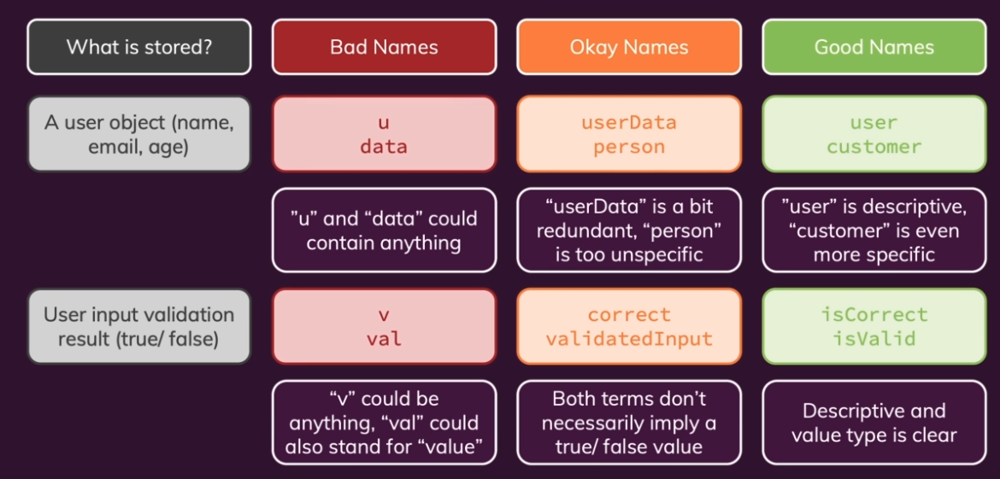
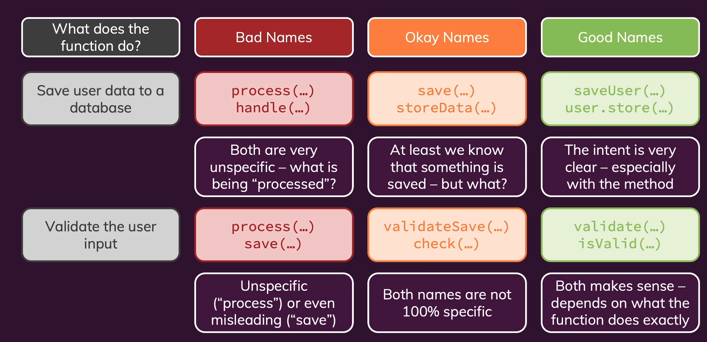

# Good Names

The main idea in naming is that:

**Names should be meaningful**

The name of a variable/function or class should provide information about what it is doing without looking at the code inside of it.

Picking good names in our code really matters.

Why names matter:

- Well-named "things" allow readers to **understand you code without going through it in detail**. It is easier and faster to read your code, to debug it.

Of course there are many different ways to provide good names, and most of the times there are many good names for a given variable, but there are some common conventions to follow.

# Choosing Good Names

We have different rules for each type of entity.

## Variables & Constants

They are data containers.

- Use **nouns** or short phrases with **adjectives**

Examples:

```
const userData = {...}

const isValid = ...
```

This names should provide an idea of _what are we storing_ on each variable.

## Functions / Methods

Functions and methods are commands, instructions that are going to run. Calculate values.

- Use **verbs** or short phrases with **adjectives**.

```
sendData();  // using a verb

getUser(); // using a verb

inputIsValid(); // using adjectives
```

## Classes

We use classes to create things, to create objects, request body

- Use _nouns_ or short phases with _nouns_

```
// using nouns
class User {
    ...
}

class RequestBody{
    ...
}
```

# Name Casing

In programming with have 4 main casing options

- snake_case: is_valid, send_response. eg: Python in variables, functions, methods

- camelCase: isValid, sendResponse. eg: Java, Javascript in variables, functions, methods

- PascalCase: AdminRole, UserRepository. eg: Python, Java, JS, for Classes

- kebab-case: <side-drawer>. eg: HTML in custom HTML Elements

# Naming Variables, Constants & Properties

### Value is an Object

The name should simply describe the value.

```
const user = new User();
const database = new DB();

// provide more detail without introducing redundancy:

const authenticatedUser
const sqlDatabase
```

### Value is Number of String

The name should simply describe the value.

```
const name = 'Franklin';
const age 23;

// provide more detail without introducing redundancy:

const firstName = 'Alex';
```

### Value is a Boolean

**The name should be a question than can be answered with true or false**.

```
const isActive = true;
const loggedIn = false;

// provide more detail without introducing redundancy

const isActiveUser = true;
```

Some examples:



# Naming Functions & Methods

- Function performs an operation: Describe the operation

```
getUser(...)
response.send()
```

- Function computes a boolean: Answer a true/false question

```
isValid(....)

purchase.isPaid()
```

You can always provide more details, but be careful to avoid redundancy

```
getUserByEmail()

isEmailValid()
```

Some examples:


# Naming Classes

We should always **describe the object** that we are creating.

Avoid redundant suffixes.

Examples of Good Names:

```
class User {
    ....
}

class Customer{
    ...
}

class Database{
    ...
}

class SQLDatabase{
    ...
}
```

# Common Error & Pitfalls

</br>

- **Don't include redundant information in names**.

```
userWithNameAndAge = User('Max',31); // too specific

// think about it, we don't want to know all the details in all the time
```

- **Avoid the use of Slang, Unclear abbreviations & Misinformation.**

```
product.diePlease() // using slang

const ymdt = '2022-09-18'; // unclear abbreviation

const userList = {a:..., b:...} // misinformation, this is not a list, it is an object
```

- **Avoid similar names, choose Distinctive Names**.

Don't do this:

```
analytics.getDailyData(day)
analytics.getDayData()
analytics.getRawDailyData(day)
analytics.getParsedDailyData(day)

// all these methods looks familiar, not a good practice
```

Instead, do this:

```
analytics.getDailyReport(day)
analytics.getDataForToday()
analytics.getRawDailyData(day)
analytics.getParsedDailyData(day)

// every name is Distinctive, easier to understand 
```

- **Be Consistent**

Let's say you have a function to return users from a DB, we have multiple options:

getUsers(), fetchUsers(), retrieveUsers()

All of these names are okay, but be consistent for new parts in your program, let's say now you want to retrieve other entities, be consistent with the names.

Bad practice:

```
getUsers()
fetchProducts()
retrieveReports()
```

Instead, do this:

```
getUsers()
getProducts()
getReports()
```

Be consistent !