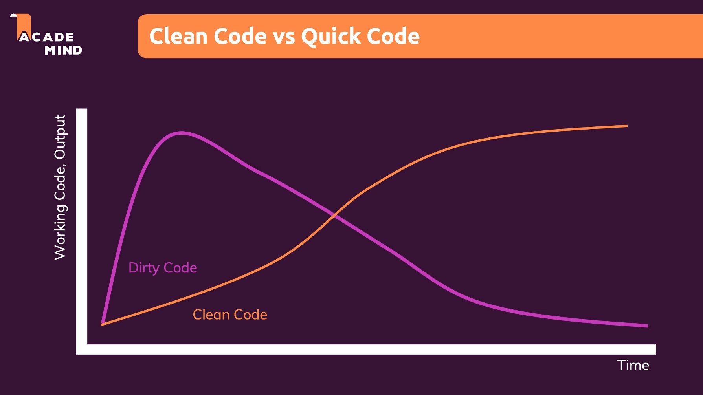

# Clean Code Basics

## What is Clean Code ?

A sign of **Bad/Dirty Code** is the code that you need to read multiple times to be able to understand it.

The code should be readable and understandable.

Clean code **is not about whether code works**. **It is about writing code easy to understand.**

A vast majority of the developer's time is spent reading and understanding code. Reading other people's code in order to add a new feature, solve a bug.

It is totally possible to write code that works but that is dirty and hard to understand. On the other hand, it is also totally possible to write code that works and that is easy to read and maintain. The second options is the best approach.

There are entire projects that die because they are difficult to maintain and understand.

Code:

- Should be **readable and meaningful.**

- Should **reduce cognitive load** while reading it.

- Should be **concise** and "to the point".

- Should **avoid unintuitive names, complex nesting** and **big code blocks**.

- Should follow **common best practices** and patterns.

- Should be **fun to write and to maintain**.

Clean code is easy to understand, dirty code is not easy to understand.

 

> You should write your code as a good writer / storyteller.

Think about you code as an easy, you are the author of your code. Write it such that it's fun and easy to read and understand !

 

## Key Pain Point

Places where the code can be hard to read, key pain points:

- Names of : Variables, Functions, Classes

- Structure & Comments : Code Formatting, good & band comments

- Functions: Length of the Functions, Number of Parameters.

- Conditionals & Error Handling: Deep Nesting, Missing Error Handling.

- Classes & Data Structures: Missing distinction between classes and data structures, Bloated Classes.

Solutions to write cleaner code:

Rules & Concepts
Patterns & Principles
Test-Driven Development

### Some Different Concepts that are Related

**Patterns & Principles:** Write code which is **maintainable and extensible**.

**Clean Code:** **Write** code which is **readable & easy to understand.** We focus on single problems/files.

**Clean Architecture:** How you structure your project, how you separate your entities. **Where** to write which code. We focus on the project as a whole.

Both concepts are related. Off course you should follow code patterns and principles, but write them in a clean way.

### Clean Code is Written Over Time !

Of course you want to write the best and cleaner code right from the _beginning_ or your project. But you _will always find_ ways to improve your code later on.

As your project _evolves and changes_, then your code _will need to change_.

**Question old code and refactor a lot !.**

Refactoring is totally normal flow, you start writing new features, and then after the complexity grows, you find cleaner and clever ways to write code.

Writing clean code is an **iterative process**, and you'll always find better ways to do things.

> You'll save time tomorrow by refactoring today.

## Clean Code vs Quick Code

If you write quick code under pressure, without clean code guidelines, you'll be able to deliver a lot of code and new features at the beginning, but then you'll start investing all of your time finding and fixing bugs in a codebase that is hard to read and maintain, so you'll slow down your delivery time and your project is not going to last too much.

On the other hand, if you start writing clean code, at the beginning the process is going to be slow compared to quick code, but adding new features will be always easier, you'll probably have less bugs, and if you need to solve bugs it is going to be easier to find the root causes of the problems. So your project will be easy to maintain and will have a longer life.

 

